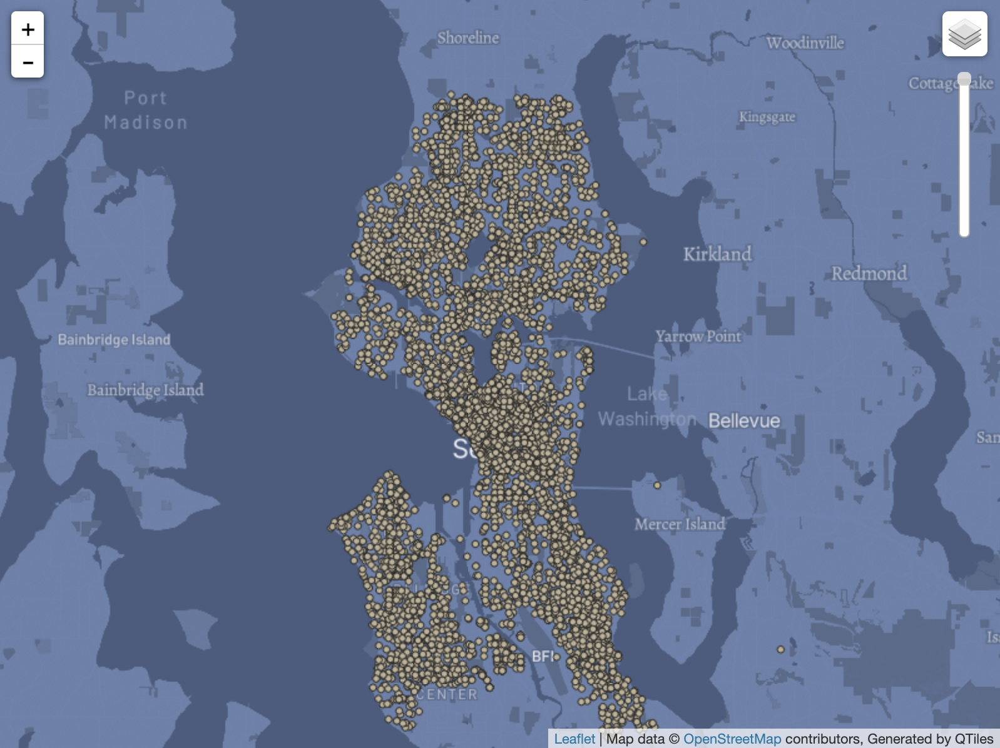

# Tile_Map

### Tile 1: Adjusted Base Map

For this base map, I changed the color and the font of the major city and state names. I also changed the color of the major roads. This base map is focusing in the Seattle Area.

### Tile 2: Data Map

This data map, shows the data for 911 medical class in the Seattle area. This data is currently update for 2024 and can be found at https://data.seattle.gov/Public-Safety/911-Calls-for-Service/65db-xm6k.

### Tile 3: Base Map with Data

For this map, I combined the base map and data map. I used the data map to color the base map and it's still focusing on the Seattle area.

### Tile 4: LGBTQ+ Pride Theme Map

The theme of this map is using pride colors. Althought, the color might be a bit off, but I tried my best. This map use color to highlight out the roads, land, water and more.

Data Source: https://data.seattle.gov/Public-Safety/911-Calls-for-Service/65db-